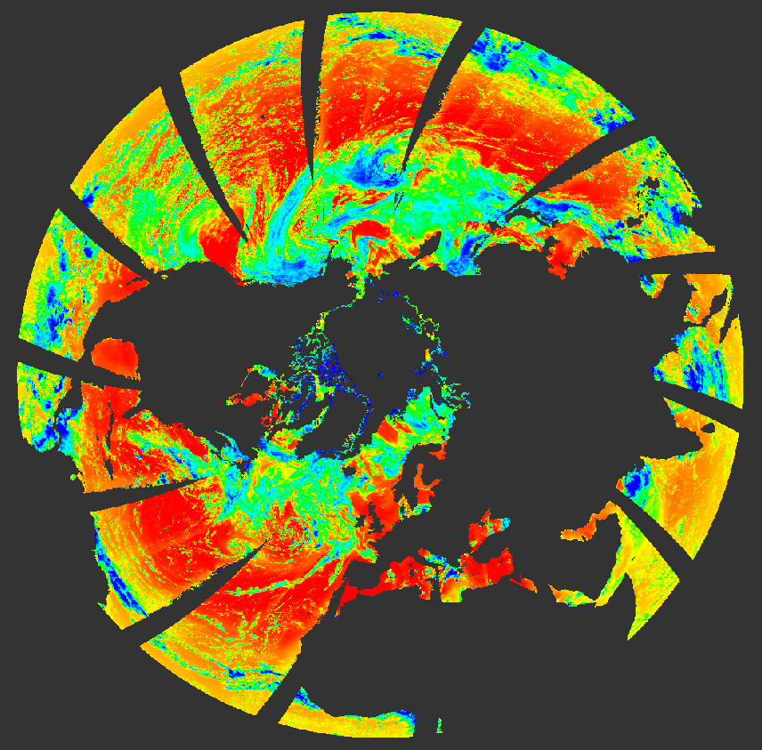

::: {.callout-note}
QUARK is a reprojection and aggregation engine for xarray datasets with 2-D geolocation arrays. It is designed to be simple for common workflows and extensible for advanced use cases.
:::

## Map Example

<div align="center">

{alt="Daily PAR reprojected to a polar view" width="800"}

*Figure 1 — SEN3 OLCI: Daily PAR (Photosynthetically Active Radiation) aggregated and reprojected to a polar view using QUARK.*

</div>

## Highlights

- **N-dimensional datasets** — 2D, 3D, 4D, and beyond
- **Multi-dataset processing** — accumulate across multiple datasets in one pass
- **Supersampling** — improved spatial coverage with subpixel grids
- **Multiple projections** — equirectangular, polar, and extensible
- **Kahan Summation** — improved numerical accuracy (requires numba)

## Installation

Install quark from the HYGEOS package index:

```bash
hyp add --hygeos quark
```

Or install directly from source:

```bash
pip install -e ".[git]"
```

## Quick Example

```python
import xarray as xr

from quark.aggregate import Aggregator
from quark.projection.equirectangular import EquiRectangular
from quark.utils import bbox_area

ds = xr.open_dataset("input.nc")

projection = EquiRectangular(
    width=2000,
    height=2000,
    area=bbox_area(ds, margin=0.05),
)

result = Aggregator(
    projection=projection,
    datasets=[ds],
    return_counts=True,
).compute()

result.to_netcdf("output.nc")
```

## Features Overview

### Supersampling

Supersampling projects a `factor x factor` subpixel grid for each source pixel, improving coverage when the source footprint is large relative to the target grid.

Two modes are available:

- **`SpatialSuperSampler`** — estimates local pixel width from neighboring pixels. Works well for structured rasters and well-behaved swaths.
- **`ConstantSuperSampler`** — uses a fixed width (e.g., `"1km"`). Safer for irregular geolocation data.

::: {.callout-warning}
Spatial supersampling assumes that array neighbors are also spatial neighbors. Do not use it for unstructured inputs, badly ordered swaths, or 2-D arrays whose neighborhood topology is not physically meaningful.
:::

### Projections

Projection support is class-based. Built-in projections include:

- [`EquiRectangular`](reference/equirectangular)
- [`LambertAzimutal`](reference/lambertazimutal)
- [`PolarNorth`](reference/polarnorth)
- [`PolarSouth`](reference/polarsouth)

Additional projection classes can be added as long as they expose the methods expected by `Aggregator`.

### Kahan Summation

For high-precision accumulation, use `sum_method="kahan"`:

```python
result = Aggregator(
    projection=projection,
    datasets=[ds],
    sum_method="kahan",
    return_counts=True,
).compute()
```

::: {.callout-tip}
Kahan Summation requires `numba` and is slower than naive summation, but provides significantly better numerical accuracy for large accumulations.
:::

## Input Model

QUARK expects:

- a 2-D `latitude` variable
- a 2-D `longitude` variable
- matching shapes and dimensions for both
- data variables that include those spatial dimensions

This makes it a strong fit for swaths and geolocated rasters, but not for generic point clouds or arbitrary meshes.

## Next Steps

- **[Getting Started](articles/getting-started)** — step-by-step guide
- **[API Reference](reference/)** — detailed documentation for all classes and functions
